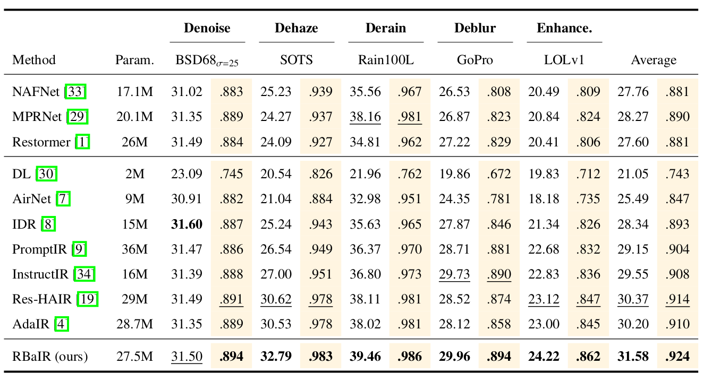

  
<h1>Towards Maximizing Feature Efficiency: All-in-One Image Restoration via Radial Basis Attention</h1>

    <a href='https://scholar.google.com/citations?user=5C9TeqgAAAAJ&hl=ko&oi=sra' target='_blank'>Cheolhoon Park</a>1&emsp;
    <a href='https://scholar.google.com/citations?user=SIfp2fUAAAAJ&hl=ko&oi=sra' target='_blank'>Hyunduck Choi</a>2,*&emsp;

    1Korea University, 2SeoulTech

    <h4 align="center">
        • <a href="https://github.com/towardsDLCV/RBaIR" target='_blank'>ArXiv</a> •
    </h4>

## Abstract

>Recent advancements in all-in-one Image Restoration (IR) have shown great promise, yet existing methods are often constrained by fixed parameters and struggle with the addition of new degradation types. In this paper, we propose RBaIR (Radial Basis Attention Image Restoration), a novel universal restoration network that significantly enhances feature efficiency and restoration performance across multiple degradations. Specifically, we design the Dynamic Radial Basis Attention (DyRBA) module, which decouples inter-channel dependencies using a Radial Basis Function Network (RBFN) to maximize feature independence. DyRBA also incorporates a data-dependent cross-attention mechanism for flexible and efficient spatial feature exploration. Then, to mitigate the attention dilution issue in attention-based models, we introduce a Mixture of Convolutional Experts (MoCE). The MoCE captures a diverse set of local and depth-dependent patterns through its multi-kernel design. Finally, we improve model generalization by introducing specialized loss functions, including the Kullback–Leibler Divergence (KLD) loss. Extensive experiments demonstrate that RBaIR achieves state-of-the-art performance, outperforming existing methods in both all-in-one and single-task restoration settings with fewer parameters.

## Installation and Data Preparation

See [INSTALL.md](INSTALL.md) for the installation of dependencies and dataset preperation required to run this codebase.

## Results
Performance results of the RBaIR framework trained under the all-in-one setting.

<strong>Three Distinct Degradations</strong> (click to expand) 

 

<strong>Five Distinct Degradations</strong> (click to expand) 

 

 

## Acknowledgement

Our code is based on the implementation of [PromptIR](https://github.com/va1shn9v/PromptIR/tree/main), [AdaIR](https://github.com/c-yn/AdaIR/tree/main) and [PIP](https://github.com/longzilicart/pip_universal). We thank their excellent works.
